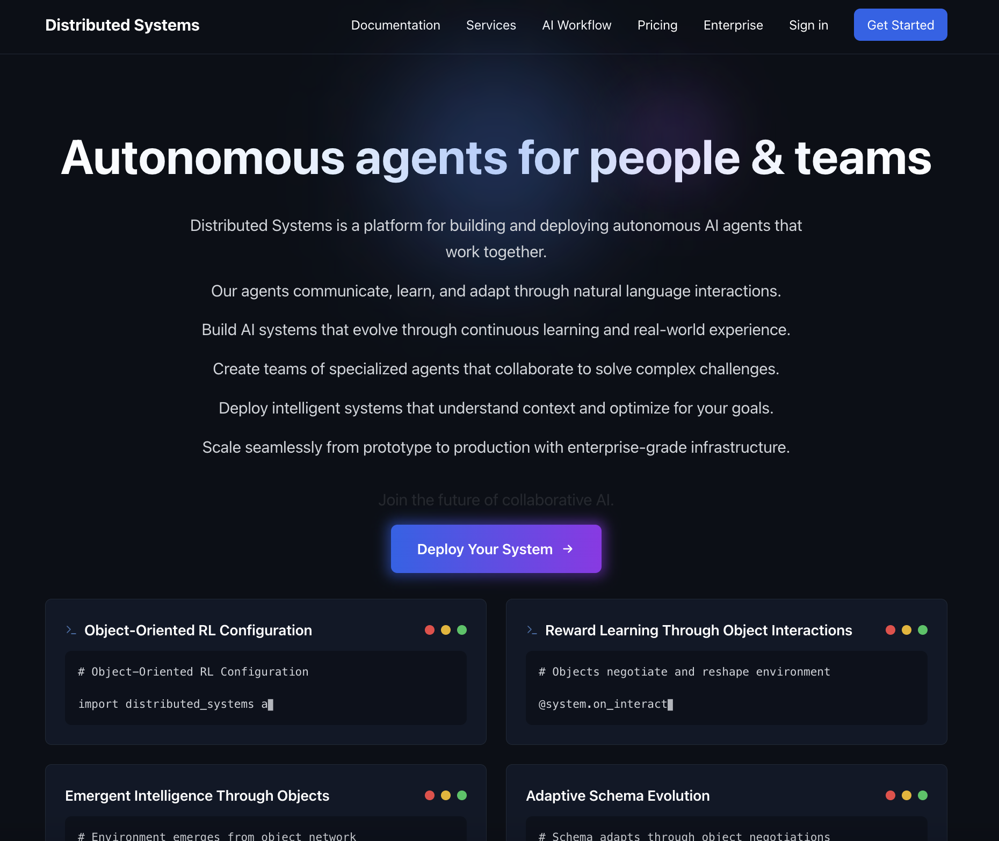

# International Distributed Systems Corporation (IDSC)

Hi! I'm Arthur, the founder of IDSC. Distributed Systems is a platform built by IDSC to enable 1 person billion dollar companies. I built a platform for building and deploying autonomous AI agents that work together. Our agents communicate, learn, and adapt through natural language interactions.

## Key Features
- Build AI systems that evolve through continuous learning and real-world experience
- Create teams of specialized agents that collaborate to solve complex challenges
- Deploy intelligent systems that understand context and optimize for your goals
- Scale seamlessly from prototype to production with enterprise-grade infrastructure

## Infrastructure
- 18+ H100 GPUs!
- 400Gb/s Network Speed
- 1,250+ Node Count
- 99.99% Availability

## Compute Options
### H100i Cluster
- $2.85/GPU/hr
- 8x NVIDIA H100 per node
- InfiniBand networking
- Automated scaling

### Reserved Capacity
- From $2.50/GPU/hr
- Long-term contracts
- Priority access
- Volume discounts

### Spot Market
- Dynamic pricing
- Real-time market rates
- Resale enabled
- Flexible durations

## Links
- Website: [distributed.systems](https://distributed.systems/)
- GitHub: [international-distributed-systems-corp](https://github.com/international-distributed-systems-corp)
- Twitter/X: [Object Oriented Reinforcement Learning in Mutable Ontologies](https://x.com/arthurcolle/status/1881166459499622496)
